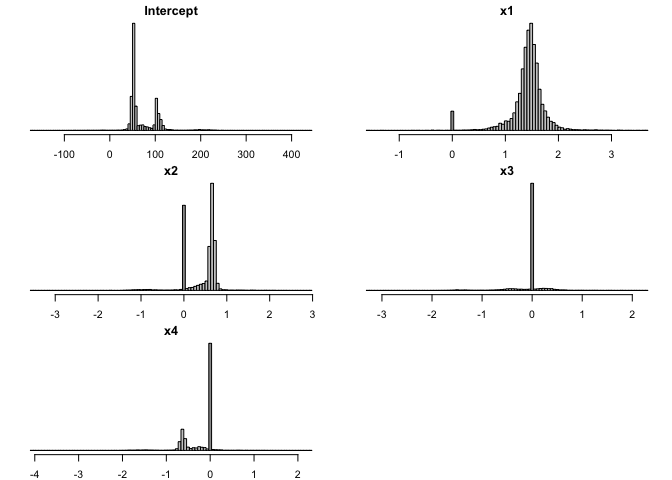

[BayesVarSel: Bayes Factors, Model Choice and Variable Selection in Linear Models](https://github.com/comodin19/BayesVarSel)
============================================================================================================================

Hypothesis testing, model selection and model averaging are important
statistical problems that have in common the explicit consideration of
the uncertainty about which is the true model. The formal Bayesian tool
to solve such problems is the Bayes factor (Kass and Raftery, 1995) that
reports the evidence in the data favoring each of the entertained
hypotheses/models and can be easily translated to posterior
probabilities.

This package has been specifically conceived to calculate Bayes factors
in linear models and then to provide a formal Bayesian answer to testing
and variable selection problems. From a theoretical side, the emphasis
in the package is placed on the prior distributions (a very delicate
issue in this context) and `BayesVarSel` allows using a wide range of
them: Jeffreys-Zellner-Siow (Jeffreys, 1961; Zellner and Siow,
1980,1984) Zellner (1986); Fernandez et al. (2001), Liang et al. (2008)
and Bayarri et al. (2012).

Installation
============

### Stable release

The stable version

can be installed using:

    install.packages("BayesVarSel")

### Development release

You can track, download the latest version or contribute to the
development of `BayesVarSel` at
[https://github.com/carlosvergara/BayesVarSel](https://github.com/comodin19/BayesVarSel).
To install the most recent version of the package (1.7.1.9000) you
should:

1.  Install devtools from CRAN with `install.packages("devtools")`.
2.  Install the development version of `BayesVarSel` from
    [GitHub](https://github.com/comodin19/BayesVarSel):

<!-- -->

    devtools::install_github("comodin19/BayesVarSel")

Features
========

The interaction with the package is through a friendly interface that
syntactically mimics the well-known lm command of `R`. The resulting
objects can be easily explored providing the user very valuable
information (like marginal, joint and conditional inclusion
probabilities of potential variables; the highest posterior probability
model, HPM; the median probability model, MPM) about the structure of
the true -data generating- model. Additionally, `BayesVarSel`
incorporates abilities to handle problems with a large number of
potential explanatory variables through parallel and heuristic versions
(Garcia-Donato and Martinez-Beneito, 2013) of the main commands.

Usage
=====

Variable selection
------------------

    library(BayesVarSel)
    #> Loading required package: MASS
    #> Loading required package: mvtnorm
    #> Loading required package: parallel
    #> #########
    #> ## NOTE: Since v1.7.0 former function 'BayesFactor' has been renamed as 'Btest'
    #> ## Copyright (C) 2013-2017 Anabel Forte and Gonzalo Garcia-Donato
    #> #########
    set.seed(171) # For reproducibility of simulations.

    data(Hald)
    hald_Bvs <- Bvs(formula = "y ~ x1 + x2 + x3 + x4", data = Hald[-c(1:2),])
    #> Info. . . .
    #> Most complex model has 5 covariates
    #> From those 1 is fixed and we should select from the remaining 4 
    #> x1, x2, x3, x4
    #> The problem has a total of 16 competing models
    #> Of these, the  10 most probable (a posteriori) are kept
    #> Working on the problem...please wait.
    summary(hald_Bvs)
    #> 
    #> Call:
    #> Bvs(formula = "y ~ x1 + x2 + x3 + x4", data = Hald[-c(1:2), ])
    #> 
    #> Inclusion Probabilities:
    #>    Incl.prob. HPM MPM
    #> x1     0.9664   *   *
    #> x2     0.6239   *   *
    #> x3     0.2644        
    #> x4     0.5466       *
    #> ---
    #> Code: HPM stands for Highest posterior Probability Model and
    #>  MPM for Median Probability Model.
    #> 
    colMeans(predict(hald_Bvs, Hald[1:2,]))
    #> 
    #> Simulations obtained using the best 10 models
    #> that accumulate 1 of the total posterior probability
    #> [1] 77.18841 71.94447

    # Simulate coefficients
    sim_coef <- BMAcoeff(hald_Bvs);
    #> 
    #> Simulations obtained using the best 10 models
    #> that accumulate 1 of the total posterior probability

    colMeans(sim_coef)
    #>   Intercept          x1          x2          x3          x4 
    #> 78.45163252  1.44424004  0.33660183 -0.02656885 -0.33266539

Model selection
---------------

    library(BayesVarSel)
    set.seed(171) # For reproducibility of simulations.
    data(Hald)
    fullmodel <- as.formula("y ~ x1 + x2 + x3 + x4")
    reducedmodel <- as.formula("y ~ x1 + x2")
    nullmodel <- as.formula("y ~ 1")
    Btest(models = c(H0 = nullmodel, H1 = fullmodel, H2 = reducedmodel), data = Hald)
    #> $BFi0
    #>  H0.to.H0  H1.to.H0  H2.to.H0 
    #>       1.0   44300.8 3175456.4 
    #> 
    #> $PostProbi
    #>           H0           H1           H2 
    #> 3.105823e-07 1.375905e-02 9.862406e-01 
    #> 
    #> $models
    #> $models$H0
    #> y ~ 1
    #> 
    #> $models$H1
    #> y ~ x1 + x2 + x3 + x4
    #> 
    #> $models$H2
    #> y ~ x1 + x2
    #> 
    #> 
    #> $nullmodel
    #> [1] 1
    #> 
    #> attr(,"class")
    #> [1] "Btest"

References
----------

-   Bayarri, M.J., Berger, J.O., Forte, A. and Garcia-Donato, G. (2012).
    Criteria for Bayesian Model choice with Application to Variable
    Selection. *Annals of Statistics, 40*: 1550-1577. DOI:
    [10.1214/12-aos1013](http://www.dx.doi.org/10.1214/12-aos1013)
-   Fernandez, C., Ley, E. and Steel, M.F.J. (2001). Benchmark priors
    for Bayesian model averaging. *Journal of Econometrics, 100*:
    381-427. DOI:
    [10.1016/s0304-4076(00)00076-2](http://www.dx.doi.org/10.1016/s0304-4076(00)00076-2)
-   Garcia-Donato, G. and Martinez-Beneito, M.A. (2013). On sampling
    strategies in Bayesian variable selection problems with large model
    spaces. *Journal of the American Statistical Association, 108*:
    340-352. DOI:
    [10.1080/01621459.2012.742443](http://www.dx.doi.org/10.1080/01621459.2012.742443)
-   Liang, F., Paulo, R., Molina, G., Clyde, M. and Berger, J.O. (2008).
    Mixtures of g-priors for Bayesian Variable Selection. *Journal of
    the American Statistical Association, 103*: 410-423.DOI:
    [10.1198/016214507000001337](http://www.dx.doi.org/10.1198/016214507000001337)
-   Zellner, A. and Siow, A. (1980). Posterior Odds Ratio for Selected
    Regression Hypotheses. *Trabajos de Estadística y de Investigación
    Operativa, 31*: 585. DOI:
    [10.1007/bf02888369](http://www.dx.doi.org/10.1007/bf02888369)
-   Zellner, A. and Siow, A. (1984). *Basic Issues in Econometrics*.
    Chicago: University of Chicago.
-   Zellner, A. (1986). On Assessing Prior Distributions and Bayesian
    Regression Analysis with g-prior Distributions. In A. Zellner (ed.),
    *Bayesian Inference and Decision techniques: Essays in Honor of
    Bruno de Finetti*, 389-399. Edward Elgar Publishing Limited. DOI:
    [10.2307/2233941](http://www.dx.doi.org/10.2307/2233941)
